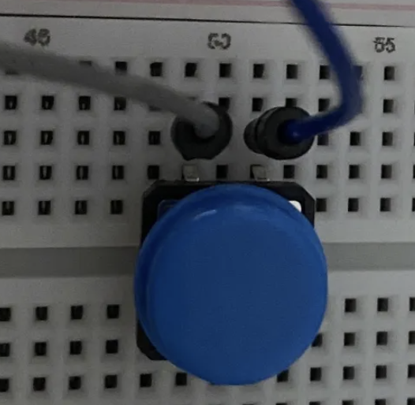

# 467-CapstoneCS

Raspberry Pi Pico firmware for a real-time indoor humidity monitor with a six stage LED array and numeric display, written in C

A capsptone embedded systems project built on the Raspberry Pi Pico (RP2040). Firmware reads humidity data from a DHT20 sensor over I2C and drives two outputs: a six stage LED bar that gives an at-a-glance humidity level, and a numeric LED display showing the exact reading. The project is implemented in a compiled language (C) to explore memory management and low-level hardware control in a resource-constrained environment.

## Getting Started

To setup and run humidity sensor device :

1. Start by wiring Pi Pico and components according to wiring diagram in build section
2. Download and unzip code
3. Compile and flash code unto Pi Pico
4. Power device

### Prerequisites

Kit including most supplies at [Amazon](https://www.amazon.com/dp/B0C3771CK8?ref=ppx_yo2ov_dt_b_fed_asin_title)

Additional sensor available at [Adafruits](https://www.adafruit.com/product/5183)

You will need :

- Pi Pico
- Breadboard
- DHT20 sensor
- (5) 220Ω resistors
- Wiring
- (5) LEDs (2 green, 2 yellow, 1 red)
- LCD 16x2 Monitor
- Button Switch (optional)
For compiling and flashing the program onto the Pi Pico, it is recommended to use:

- VS Code
- Raspberry Pi Pico Project extension on VS Code
- CMake

### Build


### Flash

## How It Works

## Project Structure

```
├── src/                   # Source files
│   ├── main.c             # if C/C++
├── include/               # C/C++ headers
├── diagrams/              # Wiring schematics
├── CMakeLists.txt         # if C/C++
├── .gitignore             # Specifies intentionally untracked files
└── README.md              # Project documentation
```

## Team

```
|      Name       |    GitHub   |
| Kyle Marasa     | @kmarasa
| Dorit Dorsey    | @doritnelson
| Margaret Barnes | @mbarnestech
```

## DHT20 Error Codes

Int value returned by DHT20 sensor describing what error occurred.

- 1 = Attempts at resetting sensor failed
- 2 = Not enough time elapsed between reading calls
- 3/7/8 = Pico generic error. Different number describes where error occurred.
- 4 = Data still generating by sensor
- 5 = all retrieved bytes are zero
- 6 = Checksum was not correct
- 100 = No clue what went wrong.

## Optional Reset Button

Wire one side of button to Pin 30 (RUN) and the other side to a ground. No code needed. Here is a picture of how the button should be attached to the wires (here the blue wire is attached to Pin 30 and the grey wire is attached to a ground).



To restart the Pico, simply press the button. 

My primary resource for this initiative, [the Raspberry Pi website](https://www.raspberrypi.com/news/how-to-add-a-reset-button-to-your-raspberry-pi-pico/), best explains how to use this when running new code on the Pico: "push and hold the RESET button, push the BOOTSEL button, release the RESET button, then release the BOOTSEL button." Then you can run new code on the Pico.
